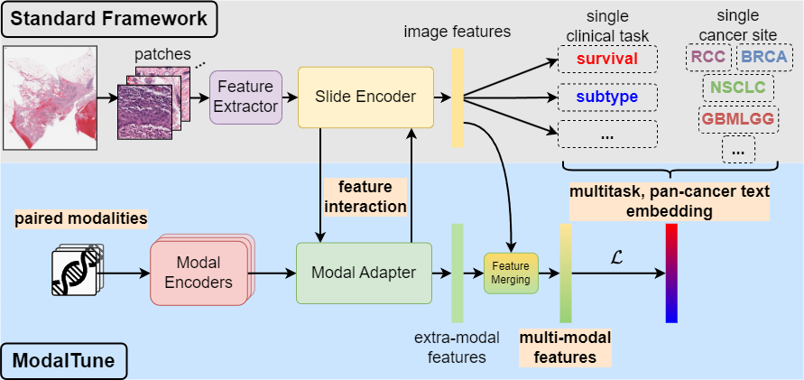

# ModalTune: Fine-Tuning Slide-Level Foundation Models with Multi-Modal Information for Multi-task Learning in Digital Pathology
Code and data for the manuscript: [ICCV 2025] ModalTune: Fine-Tuning Slide-Level Foundation Models with Multi-Modal Information for Multi-task Learning in Digital Pathology.   

Linked preprint: https://arxiv.org/abs/2503.17564

## Description

Huge datasets in digital pathology have paved the way for slide-level foundation models (SLFMs) that can improve performance on prediction tasks in low-data regimes.
However, these foundation models typically only receive image inputs, under-utilizing shared information between tasks and modalities. 
Medical institutions often only have small but varied annotated datasets which can be multi-modal (clinical records, genomics, reports, etc.), multi-task (subtype, stage, prognosis, etc.) and from many cancer sites.

We propose ModalTune, a novel fine-tuning framework to interface with existing SLFMs to integrate multi-modal, multi-task, and pan-cancer features to maximally leverage existing datasets.



 
## Key Features

- **Modal Adapter:** a plug-and-play module that works with any Transformer-based SLFM, does not alter pretrained weights, and adapts to arbitrary number of input modalities
- **Text-Based Multitask and Pan-Cancer Learning:** Permits combining arbitrary tasks and cancer sites by embedding as text while introducing language-based semantic information
 
## Experimental Results

We evaluate ModalTune and baselines on cancer subtype prediction and survival prediction for TCGA.

### Main Results
We compare ModalTune against linear probed (LP) and fine-tuned (Tuned) SLFMs, single-modal baselines, and multimodal baselines -- all trained on tasks separately. 
"cat" indicates late fusion via simple concatenation of features from each modality. 

#### Cancer Subtype prediction:

| Modality        | Method                          | BRCA              | GBMLGG            | NSCLC             | RCC               | Overall   |
| --------------- | ------------------------------- | ----------------- | ----------------- | ----------------- | ----------------- | --------- |
| **WSI-only**    | **Prov-Gigapath LP**            | 0.612             | 0.900             | 0.821             | 0.851             | 0.796     |
|                 | **ABMIL**                       | 0.853 ± 0.015     | 0.931 ± 0.040     | 0.920 ± 0.012     | 0.921 ± 0.017     | 0.906     |
|                 | **TransMIL**                    | 0.828 ± 0.011     | 0.978 ± 0.012     | 0.934 ± 0.007     | 0.918 ± 0.016     | 0.915     |
|                 | **Prov-Gigapath (Tuned)**       | 0.860 ± 0.013     | 0.931 ± 0.029     | 0.916 ± 0.012     | 0.939 ± 0.016     | 0.912     |
| **Genomics**    | **MLP**                         | 0.752 ± 0.032     | 0.998 ± 0.002     | 0.926 ± 0.007     | 0.883 ± 0.016     | 0.890     |
|                 | **S-MLP**                       | 0.839 ± 0.015     | **1.000 ± 0.000** | 0.941 ± 0.005     | 0.890 ± 0.003     | 0.917     |
|                 | **Gene Mixer**                  | 0.840 ± 0.014     | **1.000 ± 0.000** | 0.932 ± 0.005     | 0.898 ± 0.036     | 0.917     |
| **Multi-modal** | **MCAT**                        | 0.875 ± 0.014     | 0.973 ± 0.005     | 0.921 ± 0.006     | 0.933 ± 0.028     | 0.925     |
|                 | **SurvPath**                    | 0.858 ± 0.028     | 0.995 ± 0.007     | 0.932 ± 0.007     | 0.936 ± 0.030     | 0.930     |
|                 | **ABMIL (cat)**                 | 0.861 ± 0.010     | **1.000 ± 0.000** | 0.951 ± 0.003     | 0.937 ± 0.028     | 0.937     |
|                 | **TransMIL (cat)**              | 0.847 ± 0.027     | **1.000 ± 0.000** | 0.950 ± 0.004     | 0.957 ± 0.020     | 0.939     |
|                 | **Prov-Gigapath (cat)**         | 0.850 ± 0.017     | 0.998 ± 0.002     | 0.924 ± 0.011     | 0.926 ± 0.034     | 0.925     |
|                 | **ModalTune (Ours)**            | **0.899 ± 0.026** | **1.000 ± 0.000** | 0.956 ± 0.010     | **0.959 ± 0.003** | **0.954** |
|                 | **ModalTune Pan-Cancer (Ours)** | 0.858 ± 0.001     | 0.990 ± 0.009     | **0.958 ± 0.004** | 0.902 ± 0.033     | 0.927     |

#### Survival prediction:

| Modality        | Method                          | BRCA              | GBMLGG            | NSCLC             | RCC               | Overall   |
| --------------- | ------------------------------- | ----------------- | ----------------- | ----------------- | ----------------- | --------- |
| **WSI**         | **Prov-Gigapath LP**            | 0.647             | 0.795             | 0.562             | 0.679             | 0.671     |
|                 | **ABMIL**                       | 0.712 ± 0.004     | 0.854 ± 0.004     | 0.582 ± 0.002     | 0.670 ± 0.004     | 0.704     |
|                 | **TransMIL**                    | 0.742 ± 0.015     | 0.868 ± 0.009     | 0.586 ± 0.011     | 0.676 ± 0.003     | 0.718     |
|                 | **Prov-Gigapath (Tuned)**       | 0.680 ± 0.024     | 0.824 ± 0.017     | 0.546 ± 0.005     | 0.685 ± 0.012     | 0.684     |
| **Genomics**    | **MLP**                         | 0.629 ± 0.039     | 0.884 ± 0.004     | 0.542 ± 0.013     | 0.720 ± 0.002     | 0.694     |
|                 | **S-MLP**                       | 0.749 ± 0.030     | 0.887 ± 0.002     | 0.571 ± 0.011     | 0.735 ± 0.003     | 0.736     |
|                 | **Gene Mixer**                  | 0.762 ± 0.049     | 0.870 ± 0.007     | 0.556 ± 0.033     | 0.690 ± 0.009     | 0.719     |
| **Multi-modal** | **MCAT**                        | 0.673 ± 0.044     | 0.880 ± 0.006     | 0.592 ± 0.002     | 0.697 ± 0.004     | 0.710     |
|                 | **SurvPath**                    | 0.741 ± 0.031     | 0.895 ± 0.003     | **0.613 ± 0.010** | 0.677 ± 0.011     | 0.732     |
|                 | **ABMIL (cat)**                 | 0.736 ± 0.007     | **0.896 ± 0.004** | 0.605 ± 0.011     | 0.690 ± 0.004     | 0.732     |
|                 | **TransMIL (cat)**              | 0.666 ± 0.018     | 0.872 ± 0.030     | 0.595 ± 0.003     | 0.689 ± 0.004     | 0.705     |
|                 | **Prov-Gigapath (cat)**         | 0.678 ± 0.004     | 0.861 ± 0.023     | 0.573 ± 0.003     | 0.693 ± 0.016     | 0.701     |
|                 | **ModalTune (Ours)**            | **0.772 ± 0.008** | 0.879 ± 0.004     | 0.608 ± 0.023     | **0.743 ± 0.004** | **0.750** |
|                 | **ModalTune Pan-Cancer (Ours)** | 0.757 ± 0.039     | 0.860 ± 0.006     | 0.586 ± 0.020     | 0.705 ± 0.007     | 0.727     |


### Generalizability Results
We perform OOD evaluation of ModalTune on unseen cancer sites from TCGA versus baseline single-modal and multimodal tuning methods.
"Sup." indicates that the method was fine-tuned in a supervised manner on the OOD cancer site. "Cls." and "Surv." indicate that the method was fine-tuned using only classification or survival objectives, respectively.

#### Cancer Subtype prediction:

| Method                        | COADREAD          | BLCA              |
| ----------------------------- | ----------------- | ----------------- |
| **Prov-Gigapath Sup. (cat)**  | 0.581 ± 0.006     | 0.703 ± 0.018     |
| | | |
| **Prov-Gigapath LP**          | 0.510             | 0.569             |
| **Prov-Gigapath Cls. (cat)**  | 0.504 ± 0.030     | 0.497 ± 0.005     |
| **Prov-Gigapath Surv. (cat)** | 0.500 ± 0.000     | 0.497 ± 0.005     |
| **ModalTune**                 | **0.574 ± 0.024** | 0.664 ± 0.025     |
| **ModalTune Pan-Cancer**      | 0.564 ± 0.034     | **0.689 ± 0.035** |

#### Survival prediction:

| Method                        | COADREAD          | BLCA              |
| ----------------------------- | ----------------- | ----------------- |
| **Prov-Gigapath Sup. (cat)**  | 0.528 ± 0.023     | 0.673 ± 0.020     |
| | | |
| **Prov-Gigapath LP**          | 0.482             | 0.603             |
| **Prov-Gigapath Cls. (cat)**  | 0.479 ± 0.042     | 0.610 ± 0.063     |
| **Prov-Gigapath Surv. (cat)** | 0.512 ± 0.061     | 0.552 ± 0.052     |
| **ModalTune**                 | 0.539 ± 0.068     | 0.629 ± 0.041     |
| **ModalTune Pan-Cancer**      | **0.543 ± 0.020** | **0.672 ± 0.046** |


## Project Structure
```
ModalTune/
├── train_modaltune.py              # Main training script for single cancer types
├── train_modaltune_pancancer.py    # Pan-cancer multi-task training script
│
├── data_utils/                     # Data processing and preparation
│
├── dataset/                        # Processed datasets and splits
│
├── models/                         # Model architectures and components
│   ├── aggregators/                # MIL aggregation modules including ModalAdapters
│   ├── genomic_utils/              # Genomic data processing
│   ├── vitadapter/                 # Vision adapter utils
│   └── prov_gigapath/              # Prov-GigaPath model components
│
├── model_configs/                  # Model configuration files
│
├── utils/                          # Utility functions and helpers
│   ├── constants.py                # Constants and paths
│   ├── test_utils_modaltune.py     # Evaluation utilities
│   └── test_utils_pancancer.py     # Pan-cancer evaluation utilities
│
└── scripts/                        # Execution scripts
    ├── deploy_OOD_modaltune.sh     # Out-of-distribution evaluation
    ├── submit_extract_patches.sh   # Patch extraction pipeline
    ├── submit_get_dataset.sh       # Dataset creation pipeline
    └── submit_modaltune.sh         # Training pipeline
```

## Requirements

### Python Dependencies

```bash
# Core ML Libraries
torch==2.0.0
torchvision==0.15.0

# Deep Learning & Vision
timm==1.0.7
transformers==4.36.2

# Additional
warmup_scheduler
gene_thesaurus #gene processing
dplabtools #patch extraction
conch #conch and conch related packages (https://github.com/mahmoodlab/CONCH)
prov_gigapath #For running longnetvit with flash attention and other dependencies (https://github.com/prov-gigapath/prov-gigapath)
wandb #for experiment tracking
lifelines #for survival analysis
sklearn #for metrics
```

## Running

### 1. Data Acquisition

#### TCGA Histopathology Images

Download TCGA whole slide images along with clinical data from the GDC Data Portal (https://portal.gdc.cancer.gov/)

#### Genomic Data (UCSC Xena Database)

Download genomic data from UCSC Xena Browser.

Pan-Cancer dataset was downloaded from [here](https://xenabrowser.net/datapages/?cohort=TCGA%20Pan-Cancer%20(PANCAN)&removeHub=http%3A%2F%2F127.0.0.1%3A7222) under the Gene expression RNAseq section.

For other individual cancer specific RNA seq, can be downloaded by navigating TCGA Hub in the Xena database.  (https://xenabrowser.net/datapages/).  


### 2. Pre-trained Model Weights
We used the following foundation models in our experiments. 
- **CONCH** (for text embeddings): https://github.com/mahmoodlab/CONCH
- **TITAN** (for ModalTune TITAN): https://huggingface.co/MahmoodLab/TITAN
- **Prov-GigaPath** (for ModalTune Gigapath): https://github.com/prov-gigapath/prov-gigapath

At the end ensure `utils/constants.py` has the correct paths set for your data directories.

### 3. Processing Raw Dataset

#### Extract Patch Features
Patch features can be extracted using either TITAN or Prov-GigaPath models. Use the respective line in `scripts/submit_extract_patches.sh` to extract features.

```bash
bash scripts/submit_extract_patches.sh
```
#### Process rest of the data
Use the scripts in `scripts/submit_get_dataset.sh` to process genomic data, clinical text and create dataset splits.
```bash
bash scripts/submit_get_dataset.sh
```

## Training ModalTune

#### Single Cancer Type Training

Ensure that the paths in `scripts/submit_modaltune.sh` are correctly set for your dataset and model (prov-gigapath/titan) configuration. By default, we only consider imaging and genomic modalities. To include clinical information also ensure the paths are added and `$TYPE=clinical` in the `scripts/submit_modaltune.sh`. Then run for each cancer type:
```bash
bash scripts/submit_modaltune.sh
```

#### Pan-Cancer Multi-Task Training
For pan-cancer, ensure you have the pancancer dataset splits created and modify `scripts/submit_modaltune.sh` to point to the pancancer config and dataset. Then run:
```bash
bash scripts/submit_modaltune.sh
```

### Evaluation Only (Pre-trained Model)
For out-of-distribution evaluation on a new test set, modify the paths and OOD cancer types in `scripts/deploy_OOD_modaltune.sh` and run:
```bash
bash scripts/deploy_OOD_modaltune.sh
```

## Acknowledgments

We would like to express our gratitude to the following projects and resources that have significantly contributed to the development of ModalTune.
### Genomic Data Processing
- **SurvPath**: https://github.com/mahmoodlab/SurvPath/

### Foundation Models
- **CONCH**: https://github.com/mahmoodlab/CONCH
- **TITAN**: https://huggingface.co/MahmoodLab/TITAN
- **Prov-GigaPath**: https://github.com/prov-gigapath/prov-gigapath

### Architecture Components
- **ViT-Adapter**: https://github.com/czczup/ViT-Adapter
- **Mask2Former**: https://github.com/facebookresearch/Mask2Former
- **MLP-Mixer**: https://github.com/lucidrains/mlp-mixer-pytorch
- **PromptKD**: https://github.com/zhengli97/PromptKD
- **timm**: https://github.com/rwightman/pytorch-image-models

### Data Sources
- **TCGA**: [The Cancer Genome Atlas](https://portal.gdc.cancer.gov/)
- **UCSC Xena**: [UCSC Xena Browser](https://xenabrowser.net/)

## Citation

If you use ModalTune in your research, please cite:

```bibtex
@article{ramanathan2025modaltune,
  title={ModalTune: Fine-Tuning Slide-Level Foundation Models with Multi-Modal Information for Multi-task Learning in Digital Pathology},
  author={Ramanathan, Vishwesh and Xu, Tony and Pati, Pushpak and Ahmed, Faruk and Goubran, Maged and Martel, Anne L},
  journal={arXiv preprint arXiv:2503.17564},
  year={2025}
}
```

## Contact

You can reach the authors by raising an issue in this repo or email them at
vishwesh.ramanathan@mail.utoronto.ca / tonylt.xu@mail.utoronto.ca / a.martel@mail.utoronto.ca
